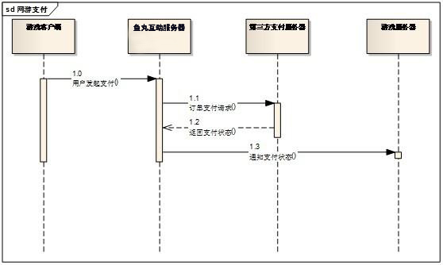

#服务端对接说明
------
##1.游戏支付流程
鱼丸互动支付流程图如下所示: 

 

所需参数如下:

|参数|含义|
|:---|:---|
|MerId|商户ID|
|NoticeUrl|	游戏服务器通知地址|
|OrderId|	订单ID|
|ProdName|	商品名称|
|EncString|	加密字符串其中EncString是商户ID,NoticeUrl,OrderId,商户密钥 四个字符串连接之后用MD5加密生成的字符串.EncString= MD5(MerId. NoticeUrl. OrderId.MerchantKey);|
|AccountNo|	支付账号(用户支付的时候需要先登录.这个是用户登录之后的支付账号.)|
|Note|支付描述(原样返回给游戏服务器的数据,开发者可以利用该字段记录信息)|
##2.游戏支付结果通知

鱼丸互动支付SDK提供电话卡支付，支付宝支付和银联等多种支付方式.
支付结果通知方式:

①支付成功: 
当游戏使用上述两种方式支付成功之后,鱼丸互动服务器会发送一次通知到游戏服务器(NoticeUrl),通知游戏支付成功.游戏服务器收到鱼丸互动发送的支付成功通知请求之后,需要立即输出一个“success”字符串,鱼丸互动服务器接收到“success”字符串默认通知游戏服务器成功。（如果没有在订单发起通知中传递NoticeUrl，鱼丸互动服务器将会通知游戏服务器提供的默认地址）
收到游戏服务器返回的“success”之后,支付跳转到支付成功界面,显示支付成功.同时页面上自动调用客户端支付通知接口通知客户端支付成功. 
支付成功时,鱼丸互动服务器通知游戏服务器的相关链接和参数如下:

|参数|含义|
|:---|:---|
|MerId|	商户ID|
|OrderId|	订单ID|
|Money	|订单金额，单位：元|
|TranCode|	交易码|
|EncString|	通知加密字符串其中EncString是 商户ID,订单ID,订单金额,商户密钥四个字符串连接之后用MD5加密生成的字符.EncString= MD5(MerId.OrderId.Money.MerchantKey);|
|PaymentFee	|支付金额，单位：元|
|PaymentStatusCode|	支付状态码 (0为支付成功,只有支付成功才会通知游戏服务器)
|Note|	即支付注释（客户端API参数中通过setNote设置） 购买时客户端应用通过API传入，原样返回给应用服务器，开发者可以利用该字段，定义自己的扩展数据。例如区分游戏服务器|
鱼丸互动服务器发送的请求链接如下示例:
http:// NoticeUrl? MerId=xx&OrderId=xx&Money=xx&TranCode=xx
&EncString=xx&PaymentFee= xx&PaymentStatusCode=xx&Note=xx
其中NoticeUrl为游戏服务器地址。地址可以在订单参数中设置，如果订单信息中未提供该参数，则通知厂商提供的默认游戏服务器地址。

②支付失败:
支付失败时,鱼丸互动服务器不会通知游戏服务器支付失败相关信息.
支付失败,直接在失败页面自动调用客户端支付通知接口通知游戏支付失败.
##3.检查用户登录SessionKey是否有效
鱼丸互动支付也提供用户登录验证：

|参数|含义|
|:---|:---|
|MerId|	商户ID|
|Act|	4(请求编号)|
|Uin|	用户的鱼丸互动帐号|
|SessionKey	|用户的登录SessionKey|
|EncString	|通知加密字符串其中EncString是 商户ID,请求编号,鱼丸互动帐号,SessionKey,商户密钥五个字符串连接之后用MD5加密生成的字符串.EncString= MD5(MerId.Act.Uin.SessionKey.MerchantKey);|
请求地址为：http://sdk.yuwan8.com/index.php/user_center

游戏服务器发出请求后，鱼丸互动服务器会验证EncString是否有效,验证SessionKey是否有效,然后返回结果给游戏服务器。
鱼丸互动服务器返回的参数如下：
{"ErrorCode":2,"ErrorDesc":"MerId无效"}

|参数|含义|
|:---|:---|
|ErrorCode|	错误码(0=失败,1=成功,2=MerId无效,5=EncString无效,11=SessionKey无效)|
|ErrorDesc|	错误描述|
